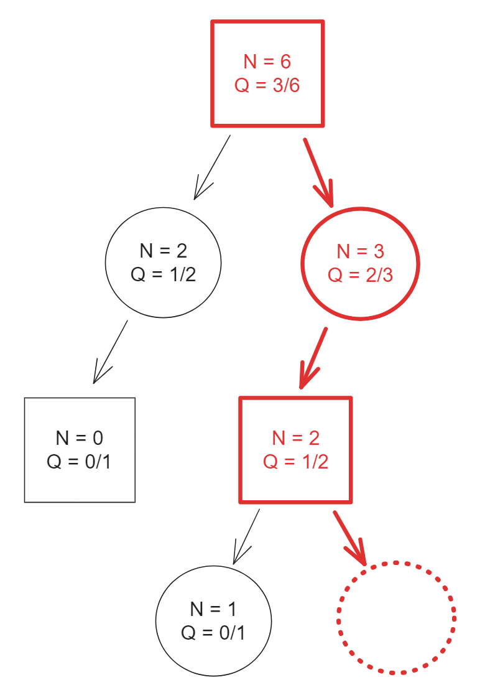
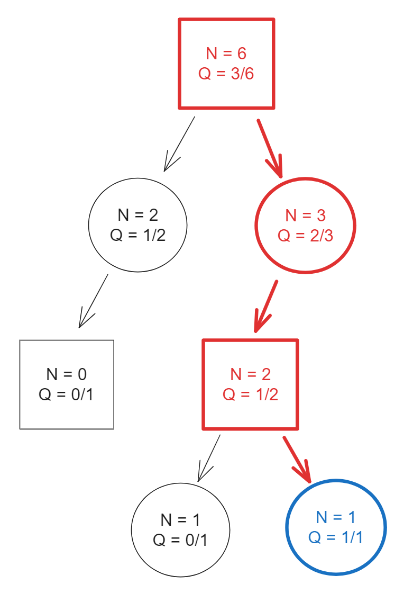
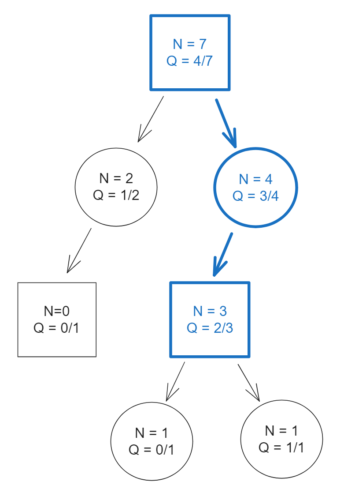
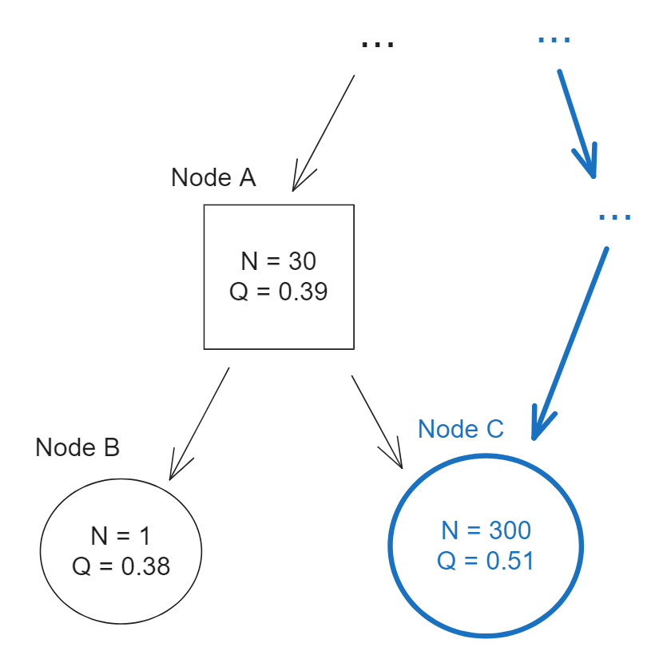
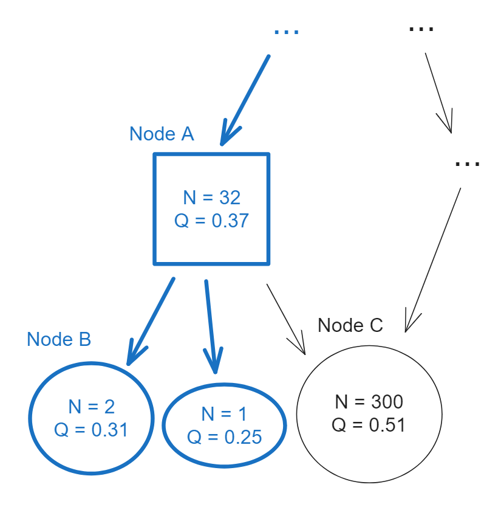
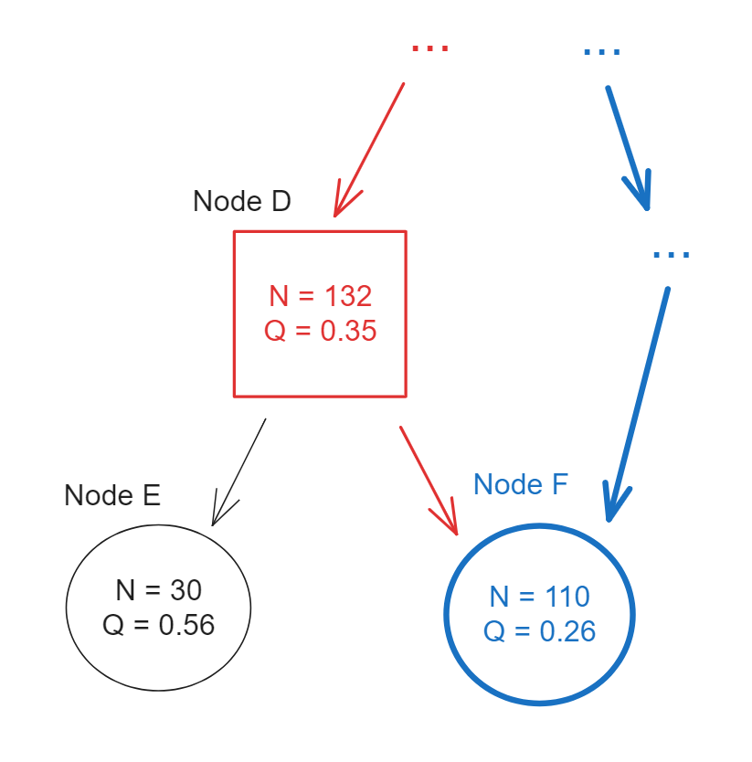

# Monte-Carlo Graph Search from First Principles
<sub>(Edit 2024-03-13: Corrected an error where PUCT was indicated as referring to "polynomial" UCT rather than "predictor" UCT, i.e. UCT/UCB with a predictive prior)</sub>

Monte-Carlo Tree Search (MCTS) except applied to directed graphs instead of trees, "Monte-Carlo Graph Search" ("MCGS"), is sometimes considered to be pretty tricky to implement in a sound way.

Unfortunately, this is partly because the perhaps-standard academic reference for it, [Monte-Carlo Graph Search for AlphaZero (Czech, Korus, and Kersting, 2020)](https://arxiv.org/pdf/2012.11045.pdf), adheres closely to the "standard" formulation for MCTS on trees. This historically-standard formulation turns out to be a poor choice for conceptually understanding the generalization to graphs. This document presents an essentially-equivalent-but-cleaner formulation that I hope many will find more intuitive, and derives from basic principles why graph search needs to work this way and reveals some additional possible implementation choices beyond those considered by Czech et. al.

## Intro / Background

In game-tree search or other applications of tree search, often we can find multiple possible sequences of moves or actions *transpose* to the same state. For example, in chess, `1. d4 d5 2. Nf3` leads to the same position as `1. Nf3 d5 2. d4`.

<table class="image">
<tr><td></td></tr>
<tr><td><sub>Example of transposition: `1. d4 d5 2. Nf3` leads to the same position as `1. Nf3 d5 2. d4`.</sub></td></tr>
</table>

When transpositions are possible in a game, usually the number of them will grow exponentially with the search depth, making deep search much more costly than needed. Ideally, we would like to these branches of the search to share their computation.

However, standard implementations of Monte-Carlo Tree Search (MCTS) usually do not do this. They treat the game as a branching tree and inefficiently re-search every instance of each duplicated position within the tree. Various low-level optimizations (for example, caching and re-using neural net evaluations for repeated positions) can greatly reduce the cost of the repeated work, but there are still major downsides. For example if MCTS discovers a critical tactic in one of the instances, the corrected evaluation of the position will not propagate to other instances.

Can we instead model the state space as a directed acyclic graph (DAG) by sharing nodes in this tree?

Yes! Whenever multiple paths lead to the same state, we can represent that state with just one node in the graph.

The tricky part is that applying MCTS naively to a DAG can easily result in an unsound algorithm. This is because MCTS is normally formulated in terms of *running statistics* of playouts, owing to its historical development as an extension of multi-armed-bandit-based methods to trees. For reasons we will see soon, naively applying this formulation to graphs does not work.

[Czech, Korus, and Kersting](https://arxiv.org/pdf/2012.11045.pdf) do a great job of fixing the problems and arriving at a sound algorithm based on this formulation, in spite of the challenges. However, there is an equivalent alternative way to approach MCTS from the perspective of *online policy learning*. In this alternative formulation, as we will see, generalization to graphs is relatively natural. It turns out we still arrive at a similar final algorithm as Czech et. al., but we can derive from basic principles _why_ the algorithm needs to work that way. If we're willing to concede some low-level optimizations, the resulting code is also much simpler.

Note that for this document we will mostly be disregarding what to do when actual cycles in the graph are also possible. The handling necessary will vary depending on the particular rules of the game (e.g. 3rd-time repetition, 'superko' rule, etc). This means that for games with actual cycles, in practice there may need to be significant additional work to handle them correctly. Here we won't address those details, we'll just focus on the core concept of how to make MCTS work. (Although, see also the [addendum](#addendum-2024-03-10---handling-cycles) with a link to a doc with some rough thoughts on handling cycles.)

## The Usual Formulation of MCTS - A Tree of Running Stats

Let's start by reviewing MCTS on trees.

MCTS is often formulated an algorithm that tracks the running statistics of playouts that traverse a tree of nodes. The portion of the game explored so far is explicitly stored as a tree of nodes in memory. Each node represents a single state of the game, and additionally tracks:
* N - the number of visits so far to this node, i.e. playouts that ended on or passed through this node.
* Q - the running average of the utility values sampled by those playouts.<sup name="footnotesrc1">[1](#footnote1)</sup>

A single iteration, or *playout*, of MCTS consists of:

1. Starting at the root of the tree, walk down the tree sampling the next action to explore according to some exploration formula.
2. Once the walk falls off the end of the tree by reaching a state not yet searched, extend the tree with a node for that new state.
3. Obtain an estimate of the utility U of the new state, e.g. by querying the value head of a neural net.
4. Walk back up the tree, at each node incrementing N and updating the average Q with the new sampled utility U.

Here's an illustration:
<table class="image">
<tr>
<td></td>
<td></td>
<td></td>
</tr>
<tr>
<td><sub>1 - Walk down tree via exploration formula.</sub></td>
<td><sub>2,3 - Add new node, estimate utility.</sub></td>
<td><sub>4 - Walk up tree, updating each node.</sub></td>
</tr>
</table>

For simplicity, the above illustration in particular uses 0/1 integer utilities for all playouts so that the Q values are
round fractions, but in general utilities would be continuous floating point values predicted by the neural net.

In Python-like pseudocode, the algorithm overall might look like:
```python
def perform_one_playout(node):
    if is_game_over(node.game_state):
        U = get_utility_of_game_outcome(node.game_state)
    else if node.N == 0:  # New node not yet visited
        U = get_utility_from_neural_net(node.game_state)
    else:
        action = select_action_to_explore(node)
        if action not in node.children:
            new_game_state = node.game_state.play(action)
            node.children[action] = Node(N=0,Q=0,game_state=new_game_state)
        child = node.children[action]
        U = perform_one_playout(child)

    node.N += 1
    node.Q = (1/node.N) * U + (node.N-1)/node.N * node.Q
    return U
```

The N and Q values in turn drive the search through the selection of the actions during this process. This is the `select_action_to_explore` in the code above. In the case of AlphaZero-style MCTS [(Silver et. al. 2017)](https://discovery.ucl.ac.uk/id/eprint/10045895/1/agz_unformatted_nature.pdf), which we'll focus on here, this would be by choosing the action at each step via the "PUCT" formula:
```math
\text{Action to explore}=\text{argmax}_a \,\, \text{PlayerToMove} * Q(a) + c_{\text{PUCT}} P(a) \frac{\sqrt{\sum_b N(b)}}{1 + N(a)}
```
where:
* $N(a)$ is the number of times action $a$ was tried, which is the same as the $N$ for the child node that $a$ leads to.
* $Q(a)$ is similarly the average utility of $a$, which is the $Q$ of the child node that $a$ leads to (or a heuristic stand-in if that node has zero visits).
* $\text{PlayerToMove}$ is -1 or 1 depending on the player to move, implementing the fact that one player is trying to maximize the utility and their opponent is trying to minimize. This would be always 1 in the case of a single-player game.
* $P(a)$ is the prior probability that the action is best, e.g. the raw policy prediction for $a$ from querying a neural net.
* $c_{\text{PUCT}}$ is a tunable constant.

As an aside, "PUCT" originated as an abbreviation for "Predictor Upper Confidence Bounds" for trees, a variant of the "UCT" or "UCB1" algorithms from the multi-armed-bandit literature that used a predictor, i.e. a prior, along with a exploration term that involves a log scaling (see [Kocsis and Szepesvári, 2006](http://old.sztaki.hu/~szcsaba/papers/ecml06.pdf) and [Rosin, 2011](https://link.springer.com/article/10.1007/s10472-011-9258-6)). AlphaZero's variant has a noticeably different functional form than the original and nowadays "PUCT" is somewhat ambiguous regarding the particular functional form and in game-playing/machine-learning circles often refers to AlphaZero's particular variant of the formula, which is also what we focus on here.

Also, as far as the name "Monte-Carlo Tree Search" itself, readers might note that there is nothing "Monte-Carlo" in the above algorithm - that it's completely deterministic! The name comes from the fact that originally, randomized rollouts to the end of the game were used for utility estimates, instead of querying a neural net. In hindsight, the name was a poor historical choice - it would be more accurate to call the algorithm something like "Bandit-based Tree Search", but for years now pretty much universally everyone has continued to use "MCTS" to refer to the modern deterministic versions.

Anyways, to run the overall MCTS algorithm, we perform as many playouts as we can before exhausting our compute budget for the turn. We select the final action by looking at the root node and picking the child node with the highest number of visits $N$ (note: NOT by picking the child with the highest $Q$, a child node with a high $Q$ and low $N$ will often be a blunder that just got a noisily high utility average due to insufficient search).

Additionally, the **visit distribution** over actions at the root node, indicating what proportion of child visits from the root node went to each child, $N(a) / \sum_b N(b)$, (e.g. pawn to e5 got 40% of the total visits, knight to d4 got 15%, etc.), can be used as the target distribution to train a neural net's policy to predict, as in the AlphaZero training loop.

In general the overall visit distribution produced by MCTS at any particular node often corresponds well with the range of plausible best actions in a position. This distribution often looks very much like the "policy" distribution of a strong agent, and in particular, a much-sharpened and refined version of the prior policy P. For reasons that we discuss more below, this is not a coincidence. This means one can do other things with this distribution that one might do with a policy. For example, it's common to sample from a policy distribution from a model using a small positive temperature. Sampling from the visit distribution with a small nonzero temperature similarly can be a good way to introduce variety in the final selected action with very little cost to overall strength.

## What Goes Wrong With Graphs?
Suppose we apply the above algorithm exactly as described, except on a directed acyclic graph instead of a tree. The algorithm is identical except that rather than always allocating a new node when reaching a new gamestate:
```python
    if action not in node.children:
        new_game_state = node.game_state.play(action)
        node.children[action] = Node(N=0,Q=0,game_state=new_game_state)
```
...instead we check if the gamestate occurred anywhere else in the search. If it does, we just point to the pre-existing node. We assume that each gamestate has a unique hash and that we have a global table `nodes_by_hash`. The new code would look like:
```python
    if action not in node.children:
        new_game_state = node.game_state.play(action)
        if new_game_state.hash in nodes_by_hash:
            node.children[action] = nodes_by_hash[new_game_state.hash]
        else:
            new_node = Node(N=0,Q=0,game_state=new_game_state)
            node.children[action] = new_node
            nodes_by_hash[new_game_state.hash] = new_node
```

Why does this not work?

Consider the following initial situation. Square nodes are where the player to move prefers high Q values. Circle nodes are the opponent's who prefers low Q values.
<table class="image">
<tr><td></td></tr>
<tr><td><sub>Initial situation</sub></td></tr>
</table>

We have 3 nodes, with Q values around 0.38 or 0.39. Currently, at node A the player prefers the action that goes to node C, and node A's Q value is dominated the roughly 30 playouts it has received, almost all of which went to exploring node C. Node C also was visited by about 40 other playouts from a transposing path.

Now, suppose node C receives a lot more playouts from transposing paths, in the process, deeper below node C a new tactic is discovered that causes node C's utility to rise a lot, to 0.51:
<table class="image">
<tr><td></td></tr>
<tr><td><sub>Suppose C gets more playouts and its utility rises 0.39 -> 0.51</sub></td></tr>
</table>

Now we have a strange situation. Initially, node A's Q value was 0.39 almost entirely because the player could play the action that led to move node C with a Q value of 0.39. Now, we've revised our estimate of node C and believe its utility is around 0.51. It's still the case that node C is the most-visited and most-preferred move at node A, therefore node A's utility estimate should also be around 0.51. But because the playouts updating node C did NOT go through node A, we did not revise our utility estimate for node A!

Moreover, suppose node A receives some playouts next. It's quite possible that following PUCT or similar move exploration formulas, node A would spend them exploring nodes *other* than node C:
<table class="image">
<tr><td></td></tr>
<tr><td><sub>Because C has many playouts, A might prefer to explore worse nodes, biasing its Q down!</sub></td></tr>
</table>

This is because although PUCT (for the square node player) prefers exploring actions with high Q values, it *also* prefers exploring actions with fewer visits so far. As the total sum of visits increases, PUCT gradually becomes willing to also spend a few visits trying some worse actions to ensure no tactic is missed. Depending on the values of parameters like the prior policy P and $c_{\text{PUCT}}$, the large number of visits on node C could well induce these visits to try other probably worse actions, because node C has "already been explored enough".

This means that the Q value of node A might even tend to go *down* over the next playouts because it is receiving playouts from actions that are likely to be bad, instead of increasing up to the "correct" evaluation of 0.51. If C received enough more playouts quickly enough relative to A, node A could in theory continue to have a significantly worse utility indefinitely.

All else equal, under this naive way of extending MCTS from trees to graphs, if a node's top-preferred moves are visited a lot by transposing lines, the node will tend to favor exploring other moves that didn't receive as many visits instead, leading to artificial biases in the utilities of the playouts being averaged at different nodes. Our algorithm is unsound to the point where even with unbounded amounts of search, it's not even obvious that we will converge to the optimal move.

### Another Non-Working Attempt to Fix Naive Graph Search:

Here's another try. What if we make it so that whenever a node is updated due to any playout, we count that playout for **all** parents (and recursively their ancestors) rather than just the parent that the playout came down through? That way, in a case like above, node A would have its utility updated during the transposing visits to node C.

But consider the following situation:
<table class="image">
<tr><td></td></tr>
<tr><td><sub>Another initial situation</sub></td></tr>
</table>

Node D has Q = 0.55. Since the square player is maximizing, this is roughly consistent with the fact that the best node under it, node E, has Q = 0.56. Node D also has spent one playout exploring node F, discovering that it is a transposition to a node F which earlier received 9 other visits from a different branch of the search, for a total of 10.

Now, suppose node F gets 100 more visits from the other branches of search:
<table class="image">
<tr><td></td></tr>
<tr><td><sub>F gets 100 more visits with similar low utility, and D's Q value gets corrupted.</sub></td></tr>
</table>

When we count all these low-utility playouts for all parents of node F, since D is a parent, this corrupts the value of node D! All the visits from node F drag down node D's Q value to 0.35, even though the best guess of what it should be based on information so far is that it should be 0.55 or 0.56, because node D leads to node E and node E has Q = 0.56. On its own, node D would never have "wanted" to put so many playouts into node F.

This algorithm is unsound as well. One could further try many arbitrary hacks to also patch this issue, but even if we stumble our way to the correct algorithm, without a better foundation, it will be hard to be sure when or why.

## Back to Theory - MCTS as Regularized Policy Optimization

Let's go back and look at a little bit of modern theory on why MCTS works, so that we can derive the correct generalization instead of guessing at hacks.

The following paper offers a foundational machine-learning-flavored perspective on MCTS: [Monte-Carlo Tree Search as Regularized Policy Optimization (Grill et. al, 2020)](https://arxiv.org/abs/2007.12509).

For us, the relevant high-level insight is that when MCTS updates its stats at different nodes, it is actually running a form of online policy learning. At any node, as we repeatedly apply the PUCT formula over successive iterations to pick child nodes to visit, the cumulative **visit distribution** chosen by PUCT approximates and converges toward the solution to the following optimization problem:

```math
\text{Find the policy π that maximizes:} \\
\sum_{a} \pi(a) Q(a) - \lambda_N D_{\text{KL}}(P || \pi)
```
Where:
* $\sum_{a} \pi(a) Q(a)$ is sum-product of the utility estimate Q of the child node the action leads to and the probability of $\pi$ to play that action.
    This is simply the estimated expected utility of following the policy, and $\pi$ is trying to maximize this.
* $D_{\text{KL}}(P || \pi)$ is the (reversed)<sup name="footnotesrc2">[2](#footnote2)</sup> KL-divergence, a measure of how different $\pi$ is relative to the prior policy $P$. $\pi$ is trying to reduce this and stay close to $P$ at the same time as it maximizes utility.
* $\lambda_N$ is a coefficient determining the strength of the KL-divergence term relative to the expected utility. It decays at a particular rate as the number of visits N increases, so that as we search more and collect more confident evidence about the utilities of the actions, $\pi$ becomes increasingly willing to deviate more from the prior policy $P$ for smaller estimated improvements in utility.
* The above is true for the PUCT formula for AlphaZero-style MCTS, but various analogous things are also true for other forms of MCTS that use different exploration formulas.

In other words, the visit distribution of MCTS is a "posterior" policy that, approximately, takes the prior policy P from the neural net and gradually improves it to maximize expected utility as more visits accumulate and give better evidence of the true utilities of the child nodes.

Effectively, MCTS is running a little learning algorithm locally at every node of the tree simultaneously, starting from the neural net's best guesses of policy and utility value, and improving it further.

This also gives context to our earlier observations on why the visit distribution can be treated so much like a high-quality policy, and for example why in AlphaZero the visit distribution is a good policy training target for future neural net training. Except for the discretization of the visits, it basically *is* the policy of a continuous learning algorithm that broadly resembles a lot of classical regularized reinforcement learning algorithms.

As an aside, it's also possible to compute the *exact* solution to the above optimization problem and use the resulting exact solution as the policy instead of the visit distribution, which is merely an approximation that converges in the limit. This is what the [Grill et. al paper](https://arxiv.org/abs/2007.12509) indeed advocates for, although doing so may come with some challenges<sup name="footnotesrc3">[3](#footnote3)</sup> in practice that aren't accounted for by the theory.

### Taking another look at Q
Let's also dig a bit deeper into what the running statistics in MCTS might mean from this perspective, especially Q.

Recall that:
* When we visit any node $n$ for the first time, the visiting playout $p$ returns the raw neural net utility prediction $U(n)$ for that game position.
* All subsequent playouts visiting $n$ will explore one of the children of $n$ and return the raw neural net utility estimate of some descendant of $n$.

Notationwise, let $\mbox{Playouts}(n)$ be the set of all playouts that visit $n$, and let $U(p)$ be the utility returned by any playout $p$.

Earlier, we defined $N$ and $Q$ for any node $n$:
> Each node tracks:
> * N - the number of visits so far to this node, i.e. playouts that ended on or passed through this node.
> * Q - the running average of the utility values sampled by those playouts.

In other words,
```math
Q(n) = \frac{1}{N(n)} \sum_{p \in \mbox{Playouts}(n)} U(p)
```

But we can also rewrite Q in a different way:
```math
\begin{align*}
Q(n) &= \frac{1}{N(n)} \sum_{p \in \mbox{Playouts}(n)} U(p) && \text{\small(by definition of Q(n))} \\
     &= \frac{1}{N(n)} \left( U(n) + \sum_{c \in \mbox{Children}(n)}\,\, \sum_{p \in \mbox{Playouts}(c)} U(p) \right) && \text{\small(as recalled above)} \\
     &= \frac{1}{N(n)} \left( U(n) + \sum_{c \in \mbox{Children}(n)}\,\,  N(c) \left( \frac{1}{ N(c) } \sum_{p \in \mbox{Playouts}(c)} U(p) \right) \right) \\
     &= \frac{1}{N(n)} \left( U(n) + \sum_{c \in \mbox{Children}(n)}\,\,  N(c) Q(c) \right) && \text{\small(by definition of Q(c))} \\
\end{align*}
```

Therefore:
```math
Q(n) = \frac{1}{N(n)} \left( U(n) + \sum_{c \in \mbox{Children}(n)}\,\,  N(c) Q(c) \right)
```

In other words, rather than thinking of Q as the average utility of all playouts that visited $n$, we can think of it in recursive terms as the weighted average of the Q values of $n$'s children (weighted by the child visit count). Plus a small $1/N(n)$ weight on the raw neural net utility estimate of $n$ itself, which is essentially a regularizing prior for Q when the visit count is low. This effectively gives us a new, recursive definition of Q in terms of child nodes' Q, rather than as an average of playouts.

However, weighting by the child visit count is the same as weighting by the visit distribution. And the visit distribution is the "posterior policy" that MCTS is optimizing! In other words, the *interpretation* of Q is that it is the (slightly regularized, estimated) expected utility of the posterior policy that MCTS is optimizing. Each node continually updates and reports this improved Q value, which is then used by the parent node for *its* own policy optimization, and so on.

In mathematical notation, letting $\hat{\pi}$ be the visit distribution that is our posterior policy, this looks like:
```math
Q(n) \approx \frac{1}{\sum_c N(c)} \sum_{c \in \mbox{Children}(n)}\,\,  N(c) Q(c) \, = \, \sum_{a \in \mbox{Actions}(n)} \hat{\pi}(n,a) Q(n,a)
```

Overall, this gives us an equivalent but different perspective on how MCTS works. MCTS is continuously optimizing a policy at every node to maximize the Q utility values that child nodes are reporting, while continuously updating the node's own Q to be the latest best guess of the expected utility achievable by that policy. In the limit of infinite search, if the child node Q values converge to game-theoretic optimal, then the node's policy converges to optimal, so the node's Q converges to the game-theoretic optimal value too, and so by recursion/induction we can see easily that MCTS is sound.

## Doing Monte-Carlo Graph Search Correctly

Okay, let's take the above perspective and derive a sound way to do MCGS with directed acyclic graphs!

All of the problems when extending MCTS naively to graphs are a result of implicitly assuming that the only visits to children of a parent node come from the parent. When a child node can instead also receive visits from a transposing path, we have problems:

* The visit counts of the child nodes can deviate arbitrarily much from what PUCT would have wanted to allocate, and so the child-visits distribution can no longer be interpreted as a reasonable posterior policy.
* The Q values of parent and child nodes are updated in inconsistent ways, such that the Q value can no longer be interpreted as the expected value of the posterior policy either.

So let's fix this!

* The theory still guarantees that *the cumulative counts of the actions that PUCT selects from a given node* is what gives a posterior policy that approximates the optimized policy $\pi$, therefore that is what we need to track rather than conflating it with child visits.
* The optimization is sound when the Q value reported by a node is *the estimated expected value of the posterior policy*. Therefore once we have the posterior policy and the child Q values, rather than dealing with how to count individual playouts, we can just apply the recursive formulation of Q. We can still also include the regularizing 1/N weight on U(n).

So, at each node $n$, we now track:
* $N(n)$ - the number of visits so far to this node, i.e. playouts that ended on or passed through this node.
* $N(n,a)$ - action visit counts - for each action $a$, how many times PUCT at node $n$ chose action $a$. We can also call these "edge" visit counts since actions correspond to edges of the graph. The distribution of these is our posterior policy.
* $Q(n) = \frac{1}{N(n)} \left(U(n) + \sum_{a} N(n,a) Q(n,a) \right)$ where $U(n)$ is the raw neural net utility estimate of the position, and $Q(n,a)$ is, recursively, equal to $Q(c)$ for the child node $c$ reached by playing action $a$ from node $n$. This is the regularized expected utility of our posterior policy.

And when computing PUCT, we use these edge visit counts rather than the child visit counts:
```math
\text{Action to explore}=\text{argmax}_a \, \text{PlayerToMove}(n) * Q(n,a) + c_{\text{PUCT}} P(n,a) \frac{\sqrt{\sum_b N(n,b)}}{1 + N(n,a)}$
```

A basic working algorithm might look like:
```python
def perform_one_playout(node):
    if is_game_over(node):
        node.U = get_utility_of_game_outcome(node.game_state)
    else if node.N == 0:  # New node not yet visited
        node.U = get_utility_from_neural_net(node.game_state)
    else:
        action = select_action_according_to_puct(node)
        if action not in node.children_and_edge_visits:
            new_game_state = node.game_state.play(action)
            if new_game_state.hash in nodes_by_hash:
                child = nodes_by_hash[new_game_state.hash]
                node.children_and_edge_visits[action] = (child,0)
            else:
                new_node = Node(N=0,Q=0,game_state=new_game_state)
                node.children_and_edge_visits[action] = (new_node,0)
                nodes_by_hash[new_game_state.hash] = new_node
        (child,edge_visits) = node.children_and_edge_visits[action]
        perform_one_playout(child)
        node.children_and_edge_visits[action] = (child,edge_visits+1)

    children_and_edge_visits = node.children_and_edge_visits.values()

    node.N = 1 + sum(edge_visits for (_,edge_visits) in children_and_edge_visits)
    node.Q = (1/node.N) * (
       node.U +
       sum(child.Q * edge_visits for (child,edge_visits) in children_and_edge_visits)
    )
    return
```

And that's it!

## Discussion of Implementation Choices

While formulated very differently, the pseudocode algorithm above is at a high level doing much the same thing as the algorithm from [Czech, Korus, and Kersting](https://arxiv.org/pdf/2012.11045.pdf), modulo several of the implementation choices discussed below and a few other minor details. Given that their algorithm is also sound, this is not too surprising, since as we found in the above derivation, the foundational theory for MCTS very naturally forces the analogous MCGS to work a certain way.

Hopefully, going through the theory of MCTS makes it more intuitive what implementation choices were "load-bearing". There are also many non-load-bearing degrees of freedom in the implementation, which we discuss here.

### Stale Q Values
One might notice that the given pseudocode algorithm still only updates the Q values the nodes on the path traversed by the playout, rather than all parents or ancestors of the nodes of the playout. This means that the Q values of nodes on non-traversed paths will become "stale". This is still theoretically sound because:
* PUCT and/or other standard exploration formulas guarantee that in the limit, even if they choose "better" actions exponentially more, they will still try every action infinitely often. This means that a node will always eventually be visited and can never be stale forever.
* We directly compute the correct Q value for a node given the Q values of its children any time the node is visited. It does not depend on the history of traversals or playouts. So no matter what state the node graph is in, once a node *is* eventually visited and made un-stale, if recursively its children have been visited and updated to the correct Q value, then the node will be updated to the correct Q value. In the limit it's not too hard to then show that on a DAG we must still converge to game-theoretic optimal.

The main reason for only updating nodes on the playout path is implementation simplicity and because doing otherwise might be more computationally costly. [Czech, Korus, and Kersting](https://arxiv.org/pdf/2012.11045.pdf) similarly only update the node Q values on the playout path.

However, stale Q values do make the search inefficient. After all, shared Q values are a big part of what is giving graph search an advantage over tree search. Depending on the situation, there may be a lot of room for improvement in strategies for reducing staleness, for example:
* One could also maintain pointers from nodes to immediate parents and also update immediate parent nodes' Q values to help propagate improved Q values up the DAG a bit faster.
* One could even update *all* ancestors recursively in a topologically sorted order so that nothing is ever stale (although this may be computationally expensive!).
* One could stick with the cheapest option of only updating nodes on the playout path, but *also* have a separate parallel thread that walks the tree continuously looking for stale nodes and updating them.
* Etc.

### Incremental vs Idempotent Updates

Another thing to notice about the given pseudocode algorithm is that it uses an idempotent update for N and Q. In this implementation, regardless of what has happened before or how many intermediate updates have happened, a single visit to a node always ensures that its N and Q are correct as a function of its children.

It is also possible to formulate an incremental update that is equivalent, or at least one that is equivalent in the limit of many visits.

This is analogous to how for the original MCTS on trees, the following two updates are equivalent following a single playout:
```python
    # Recursive, idempotent update
    node.Q = (1/node.N) * (node.U + sum(child.Q * child.N for child in node.children))
    # Incremental update. U is the final utility returned by the playout.
    node.Q = (1/node.N) * U + (node.N-1)/node.N * node.Q
```
Here, the incremental update is a bit computationally cheaper since it doesn't require iteration over children.

In the case of graphs, rather than trees, formulating a cheaper incremental update that behaves equivalently, or behaves equivalently in the limit, can be a little tricky, but it can be done and might result in higher performance. [Czech, Korus, and Kersting](https://arxiv.org/pdf/2012.11045.pdf) do in fact use a somewhat incremental formulation, since they approached the algorithm more directly from the historical "running statistics" presentation of MCTS, and so perhaps could be a reference for how to do this.

Czech et. al. also make a somewhat interesting further choice to store Q values on edges, not just edge visit counts, and add an incremental mechanism for how a stale Q value can gradually "catch up" to more recent values (in contrast to just computing the correct Q value and catching up immediately), as well as introducing a hyperparameter controlling an error tolerance at which the mechanism doesn't apply (where theoretically staleness biases smaller than the tolerance could persist indefinitely). As far as I can tell, many of these extra complications are not needed for correctness and can be conceptualized as "performance hacks/optimizations", or in some cases as changes that mildly alter exploration and the way Q values converge that might either have small beneficial effects or small costs/harms, depending on the situation. But as seen from the pseudocode given in this document, it's possible to get MCGS working with a simple algorithm, and *without* being forced to introduce any new error tolerance parameters or needing to track Q values on edges.

If one does NOT need to squeeze out the extra computational performance (e.g. if the code is GPU-bound on a neural net anyways such that CPU doesn't matter so much), then there are also some advantages to the idempotent update. For example, an idempotent update is easier to reason about, especially when also multithreading or when trying things like having a parallel thread to walk the tree and unstale-ify nodes as mentioned above. KataGo currently uses the idempotent formulation.

### Continuing vs Stopping Playouts when Child Visits > Edge Visits

In standard MCTS, adding an edge visit is the same thing as adding a child visit. These two concepts are the same on trees and we only needed to distinguish them when we move to graphs.

We can rephrase this in the language of policy optimization: whenever one upweights a given move in the node's posterior policy (by adding an edge visit), one also gives that move an incrementally larger bit of exploration to validate the Q value that it claims to have (by adding a child visit). As mentioned in [footnote 3](#footnote3), that the two increase together is good for robustness, and generally it's necessary for convergence/soundness that the child visit count tends to infinity as the edge visit count tends to infinity.

However, when transpositions occur, it's common to encounter a child node already having **more** visits than the edge that leads to it. Can we say that the child node already has "enough" visits in this case and cut short the playout, to improve the efficiency of the search?

Yes! We can just increment the edge visits and immediately skip to the step of updating the parent and it's ancestors without giving the child another visit. The child already has enough visits to "support" the upweighted edge visits that the parent wants to assign it.

However, it's not obvious that this is a good idea. Speculatively, there might be some competing considerations:
* If the edge visit count is low, while the child visit count is high, then the marginal extra visit to that child is probably less informative and less likely to be worth the compute cost given that it's already high enough for that parent, favoring stopping.
* Nodes that tend to have child visits > edge visits are likely the nodes that are being transposed to more often. This means they affect more parents, making it more important to evaluate them accurately, favoring continuing.

This is likely a good area for experimentation! One could also imagine using a more complex threshold, such as stopping if the child visits is *enough* larger, etc. It's possible that the best approach depends on the situation and/or the game.

For reference, KataGo currently DOES stop the playout by default, but offers a configuration option to continue the playout instead, or to "leakily" stop the playout some probabilistic fraction of the time. The given pseudocode algorithm above for MCGS does NOT stop the playout, but doing so is as simple as adding a one-line check, if you want to experiment with this:
```python
    if child.N <= edge_visits:
        perform_one_playout(child)
```

### Other Implementation Details

There are also some other implementation details worth mentioning beyond the basic pseudocode given above.

* For game-over nodes the above pseudocode recomputes them always to have N = 1 and U = Q = game outcome utility, no matter how many times they are visited. This is fine since it does not prevent the parents' edge visit count leading to these nodes to increase as normal, but one could also adopt the convention to increment N for a game-over node each time it is visited. Doing this and averaging the game outcome U values sampled would be important if the game outcome is stochastic and for some reason we can only stochastically sample it rather than directly compute the correct expected utility of the outcome. Alternatively, if `get_utility_of_game_outcome` is deterministic but expensive, we could as a minor optimization skip computing it if it's already computed.

* It's also possible to add broader handling for game-over utilities to propagate provable values up the graph faster. When game-over states are relevant, plain MCTS/MCGS doesn't converge to optimal as cheaply as classical searches like alpha-beta search, since there is no provision for recognizing when utility values are *certain* rather than needing more visits to refine their quality and trustworthiness.

* We assumed gamestates had unique hashes for finding transpositions. Crafting a true collision-free hash for a complex game state may be tricky and costly. However, a sufficiently-large [Zobrist hash](https://en.wikipedia.org/wiki/Zobrist_hashing), such as 128 or 192 bits, is usually sufficient in practice to entirely prevent collisions, except perhaps from adversarial gamestates generated to attack the hash. Depending on one's level of paranoia, and/or whether the game rules already allow cycles and how that is being handled, one can also add cycle detection to avoid unbounded recursion if a cycle does occur due to collision.

## Conclusion

I hope at least some people find this document and explanation of Monte-Carlo Graph Search useful! This document still doesn't cover some of the game-specific tricky bits that need to be handled regarding what happens when the game can cycle instead of being only acyclic, such as superko in Go<sup name="footnotesrc4">[4](#footnote4)</sup>, or third-time repetition in Chess. But I hope it gives some intuition behind how MCGS works, and what kinds of implementation choices could be interesting to vary and experiment with.

## Addendum (2024-03-10) - Handling Cycles
In case it's further also helpful to someone, here's a link to a Google Doc with some thoughts on how to handle N-fold repetition and cycles in games like chess or in general. These thoughts are very much not as polished and doing this well may require some game-specific experimentation on heuristics: https://docs.google.com/document/d/1JbxsoMtr7_qAAkfYynAgpvuarMMJycaL5toXdnqVJoo/edit

<hr>

## Footnotes
<a name="footnote1" href="#footnotesrc1">1</a>: It's also common to see code that tracks NxQ instead of Q, i.e. the running *sum* of playout utilities rather than the running average, and only divides by N at the end when querying the utility. This leads to a slightly simpler update, but in some cases may make certain lock-free multithreading implementations harder to reason about because it opens the chance for split reads: namely reading N and NxQ that are desynchronized, such that dividing NxQ by N gives a bogus value for Q.

<a name="footnote2" href="#footnotesrc2">2</a>: In general, $D_{\text{KL}}(Y || X) = E_Y (\log(Y) - \log(X))$ is _"How surprised will I be if Y is true, given I initially believe X?"_.

For example suppose Y is the same as X except that Y puts a little bit of probability mass on an outcome A that X considers to be earthshatteringly unlikely. Then:
* $D_{\text{KL}}(Y || X)$ will be large because even if Y doesn't think A is too likely, if A does happen X will be astronomically surprised.
* $D_{\text{KL}}(X || Y)$ will be small, because for every outcome X considers to be possible, Y also considers it almost equally possible too. Y will never be unduly surprised by X.

Given the roles these play, often one sees something like $D_{\text{KL}}(\text{Posterior || Prior})$, "How surprised will I be if Posterior is true, given I initially believe Prior?". Penalizing this term would mean that Posterior is encouraged to be a "subset/sharpening" of Prior. Posterior strongly wants to ONLY consider moves that Prior considers, but does NOT get penalized as much for failing to consider all of them.

Here though, we have a reversed KL divergence, $D_{\text{KL}}(P || \pi)$ where $\pi$ is the Posterior and $P$ is the Prior. Penalizing this term means that Posterior is encouraged to be a "superset" of Prior. Posterior strongly wants to consider ALL moves that Prior considers, but does not get penalized as much if it also considers some moves that Prior would think to be earthshatteringly unlikely.

Both KL divergences behave very similarly in the common case. But in the edge cases where they differ, the reversed KL divergence is arguably the better one for exploration (by making sure it considers ALL moves in the Prior) and for recovering from partial overfitting/overconfidence of the neural net (by tolerating when it considers moves that Prior thinks are entirely impossible), and this turns out to be the one MCTS implicitly uses.

<a name="footnote3" href="#footnotesrc3">3</a>: A big challenge in practice with using the exact solution seems to be that using the direct solution to $\text{argmax}_{\pi} \sum_a \pi(a) Q(a) - \lambda_N KL(P || \pi)$ can sometimes put a large policy weight on a move with relatively few visits if its Q appears good enough. However, moves with high Q values but low visits are often erroneous, such as when a shallow search blunders by overlooking a key tactic. This problem maybe manifests more often at larger amounts of search the very shallow 50-visit searches tested in the paper.

From a theory perspective, we could say perhaps this is because the optimization problem doesn't account for differing _uncertainty_ based on the number of visits. There can also be problems due to correlations or adverse selection in the uncertainty in utilities, e.g. the same tactic occurs in many possible branches and throughout the search all the seemingly-highest-Q branches are *precisely* the branches overlooking that tactic and blundering. Using the visit distribution as the posterior policy is far more robust to this, because the only way to increase the weight of a move in the visit distribution is to actually search the move extensively. This means that a move cannot get a high weight until a deeper analysis of that move confirms the high Q value and cannot find any flaws in it.

<a name="footnote4" href="#footnotesrc4">4</a>: For those curious, KataGo handles it in Go by leveraging an easily-proved theorem specific to Go: "Suppose a move has been played on some location. Let E be the number of empty spaces in all connected empty regions that border that move, and let S be the number of stones in the chain that contains that move. Then, even if the players cooperate, it will take at least S+E-1 moves to return to the position prior to that move". Based on this theorem, which can lower-bound the lengths of cycles, it's possible to construct a hash of the history that will almost never prevent sharing nodes for transpositions in normal situations, and yet is completely reliable at *not* sharing nodes when cycles are relevant, for all cycles up to a configurable desired cycle length.

