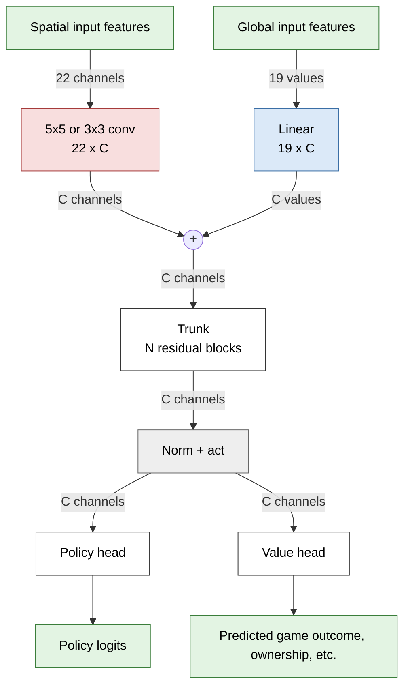
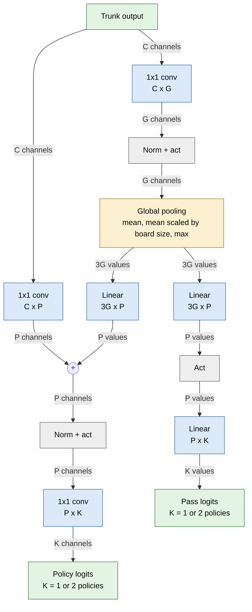
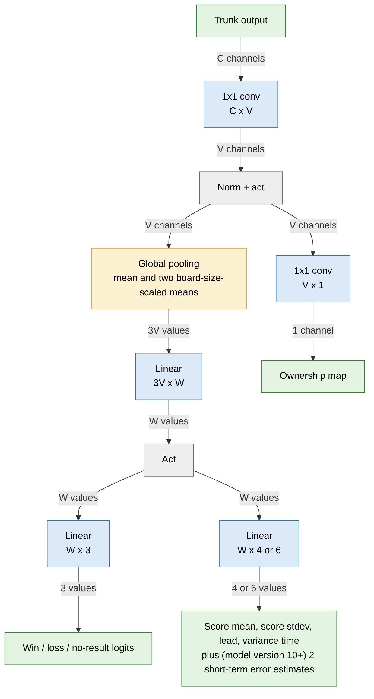
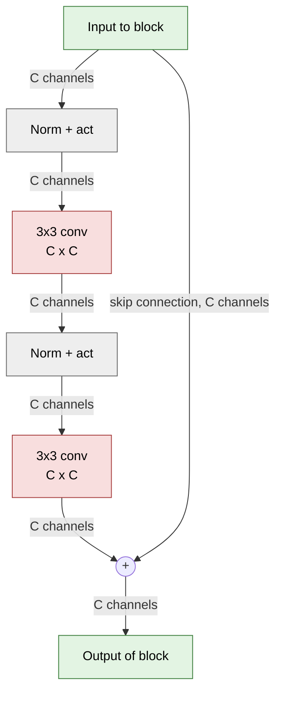
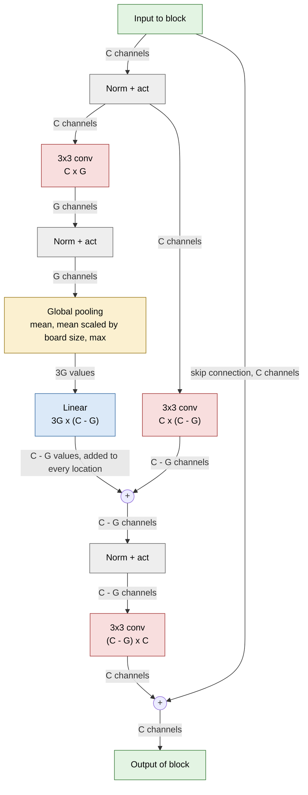
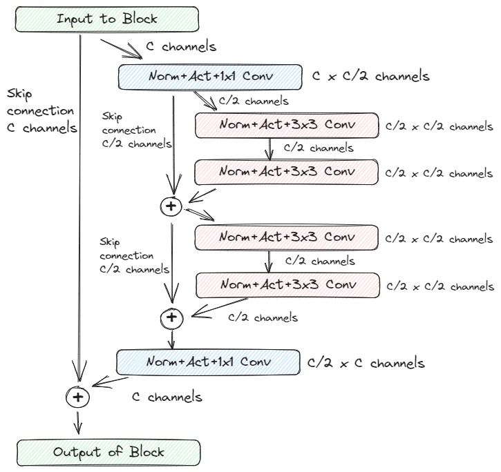
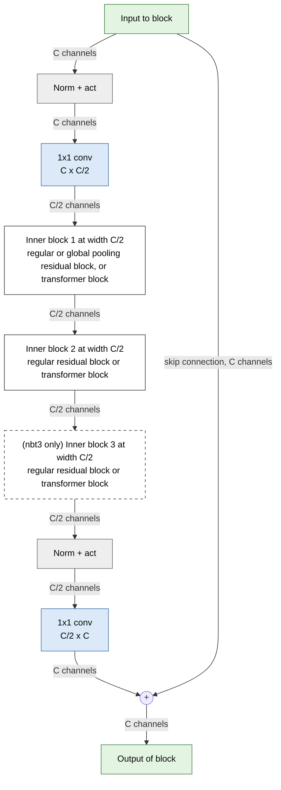
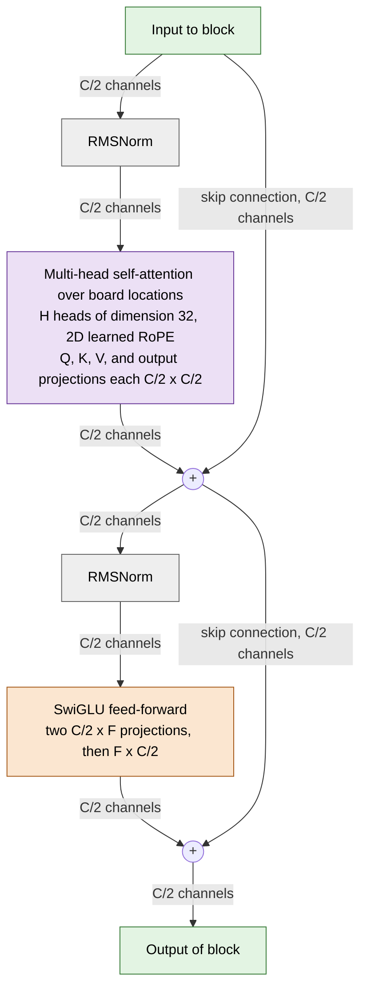

# KataGo Network Sizes and Architectures

This document lists each neural network size on the KataGo distributed training site (https://katagotraining.org/networks/) in the main run as of 2026-08 and describes the architecture of each one.

* [Summary](#summary)
* [Common structure](#common-structure)
  * [Trunk](#trunk)
  * [Policy head](#policy-head)
  * [Value head](#value-head)
* [Block types](#block-types)
  * [Regular residual block](#regular-residual-block)
  * [Global pooling residual block](#global-pooling-residual-block)
  * [Nested bottleneck residual block](#nested-bottleneck-residual-block)
  * [Transformer block](#transformer-block)
* [Details for each size](#details-for-each-size)
  * [Training config names](#training-config-names)
  * [Layout](#layout)

## Summary

| Size | Kind | Num Params | Rough cost per eval | Peak Elo | Upload dates |
|---|---|---|---|---|---|
| b6c96 | Convnet | 1,027,911 | 0.04x | ~9960 | 2020-11-28 (g170) |
| b10c128 | Convnet | 2,994,503 | 0.07x | ~11520 | 2020-11-28 (g170) |
| b15c192 | Convnet | 9,930,951 | 0.2x | ~12220 | 2020-11-28 (g170) |
| b20c256 | Convnet | 23,483,463 | 0.3x | ~12900 | 2020-11-28 (g170) |
| b40c256 | Convnet | 46,651,849 | 0.6x | ~13410 | 2020-11-28 to 2023-03-20 |
| b60c320 | Convnet | 108,489,993 | 1.3x | ~13550 | 2021-08-10 to 2023-11-30 |
| b18c384nbt | Convnet + nbt | 26,326,985 | 0.5x | ~13620 | 2023-03-04 to 2024-05-26 |
| b28c512nbt | Convnet + nbt | 72,830,569 | 1.0x | ~14160 | 2024-05-02 to 2026-06-07 |
| b40c768nbt | Convnet + nbt | 232,532,105 | 3x | ~14550 | 2026-04-06 to 2026-07-27 |
| tf2-b10c384 | Transformer + nbt | 10,545,753 | 0.3x | ~13710 | 2026-08-25 |
| tf3-b10c512 | Transformer + nbt3 | 28,537,801 | 0.6x | ~14170 | 2026-08-25 |
| tf3-b11c768 | Transformer + nbt3 | 70,442,025 | 1.1x | ~14540 | 2026-08-25 to present |

(Elos last estimated as of around 2026-08-30)

Notes on the table:
* "Size" is the short name that the site uses in network names. See [Details for each size](#details-for-each-size) below for the corresponding architecture name in [python/katago/train/modelconfigs.py](../python/katago/train/modelconfigs.py).
* "Kind" is the block type used in the trunk. "Convnet" uses the classic AlphaZero-style residual block with two 3x3 convolutions. "nbt" indicates a nested bottleneck architecture, see [Nested Bottleneck Residual Nets](KataGoMethods.md#nested-bottleneck-residual-nets) in KataGoMethods.md or [Nested bottleneck residual block](#nested-bottleneck-residual-block) below, and "nbt3" indicates three sub-blocks per trunk block instead of two.
* "Peak Elo" is the approximate highest Elo rating measured on katagotraining.org among networks of that size, based on the rating games between networks there, anchoring random play at Elo 0. The rating games are played with an equal number of visits per move for both sides, so Elo here measures strength per search evaluation and does not account for how fast each network runs. Given the quantity of games, most ratings have a standard error of 10 to 25 Elo relative to networks nearby.
* The three transformer networks were uploaded much more recently than the others, so they have fewer rating games so far and their ratings are somewhat more likely to shift as more games are played.
* "Rough cost per eval" is an estimate of the inference cost of one network evaluation relative to b28c512nbt. This is *extremely* approximate. The real cost ratio depends massively on the hardware, backend, number of threads, and batch size of the use case, may change with future optimization work, etc.
* The early networks with an upload date of 2020-11-28 were imported from KataGo's earlier private "g170" run, from which the public kata1 run continued training much further.
* The katagotraining.org site has both "b20c256" and "b20c256x2" networks, and "b40c256x2" and "b40c256" networks. The x2 is a historical artifact of labeling training lineages of the same architecture on different-GPU machines (one-GPU training vs switching to two-GPU training, etc) around g170, which turned out not to matter much, and we don't distinguish them here.
* Parameter counts are based on the C++ engine's count, which may exclude some of the heads or copies of heads from the pytorch checkpoint (not all heads are exported for inference). Networks of the same size but exported at a different model version can differ by a few hundred parameters in the heads. Parameter counts may also differ slightly between different models of the same underlying architecture due to ongoing development. For example the g170 b40c256x2 files have 46,651,591 parameters, 258 fewer than the kata1 b40c256 files, because the kata1 networks were exported as "model version 10", which adds two more outputs to the value head, short-term value and score error predictions. See [cpp/neuralnet/modelversion.cpp](../cpp/neuralnet/modelversion.cpp#L4-L24) and [python/katago/train/modelconfigs.py](../python/katago/train/modelconfigs.py#L26-L43) for a brief summary of what changed in each model version.

## Common structure

In all of the following diagrams, each layer node shows its weight shape as input width x output width, and each edge is labeled with the width of the data flowing along it. For edge labels, "channels" indicates the given number of channels per board location, "values" indicates that many values for the entire board (i.e. a tensor that doesn't have spatial dimensions). Colors mark the kind of layer: green for inputs and outputs, red for 3x3 convolutions, blue for 1x1 convolutions and linear layers, yellow for global pooling, purple for attention, orange for feed-forward layers, and gray for normalization and activation.

Every network has the same overall structure: an input encoder, a trunk of residual blocks operating on a spatial feature map with some number of channels per board location, a final normalization and activation, and various output heads. The board can be any size up to 19x19, and off-board locations are masked out of every convolution, pooling, and attention operation.

### Trunk

The trunk is a stack of N residual blocks of some common block type, each reading from the trunk so far and adding its output back to the trunk. The block types are described in [Block types](#block-types). In the convolutional networks, a fixed subset of the blocks, roughly every third to sixth block, are "global pooling" blocks, which include a branch that involves global spatial mean or max pooling so that the network can see across the entire board to compute whole-board averages or peaks. The transformer networks don't use this because attention already can see the whole board.

The initial convolution is 5x5 in the older networks (b6c96 through b40c256) and 3x3 in b60c320 and everything after it.

### Policy head

The policy head outputs logits whose softmax is the policy prediction of the model for which moves are best. A small global pooling branch gives the per-location convolution access to whole-board information, and is also used to compute the logit for passing.

K is 1 for older models (model version < 12) and is 2 for newer models, where the second output is the "optimistic" policy described in [KataGoMethods.md](KataGoMethods.md#optimistic-policy). Also, before model version 15 the pass logit was a single linear layer from the pooled values rather than a two-layer one.

### Value head

The value head applies global spatial mean pooling to summarize the whole board down to a vector of 3V values, then predicts game outcome, score, and various other things. It also produces an ownership map from the pre-pooling features.

## Block types

### Regular residual block

The b6c96 through b60c320 networks use pre-activation residual blocks with two 3x3 convolutions.

This is the classic residual block of AlphaGo Zero and Leela Zero, except for the normalization scheme. The g170 networks and the kata1 networks through b60c320 were trained with Fixup initialization and no batch normalization, as described in [KataGoMethods.md](KataGoMethods.md#fixup-initialization). The activation was ReLU for these older networks, and changed to Mish when used as the blocks within the nested bottleneck blocks in later models.

### Global pooling residual block

In the convnets, roughly one out of every 3-6 blocks is a global pooling block. This is a regular residual block but where some of the channels feed into a global spatial pooling mechanism, as shown in the diagram. See also KataGo's [original paper](https://arxiv.org/abs/1902.10565).

### Nested bottleneck residual block

The b18c384nbt, b28c512nbt, and b40c768nbt convnets and all three transformer networks use the nested bottleneck block described in [KataGoMethods.md](KataGoMethods.md#nested-bottleneck-residual-nets). A 1x1 convolution projects from C trunk channels to C/2 inner channels, a short stack of inner residual blocks runs at width C/2, and a 1x1 convolution projects back to C channels. In the convnets the inner blocks are regular residual blocks, and the first inner block of a global pooling block is a global pooling residual block as in the previous section. In the transformer networks the inner blocks are the transformer blocks described in the next section. The "nbt" networks, which are the three convnets and tf2-b10c384, have two inner blocks per trunk block, and the "nbt3" networks tf3-b10c512 and tf3-b11c768 have three.

<table class="image">
<tr><td></td></tr>
</table>

The convnets using these blocks use the Mish activation and were trained with fixed variance initialization and one batch norm layer, as described in [KataGoMethods.md](KataGoMethods.md#fixed-variance-initialization-and-one-batch-norm).

### Transformer block

In the transformer networks, each inner block of a nested bottleneck block is a pre-norm transformer block: a self-attention layer and a feed-forward layer, each with its own residual connection. Self-attention treats the board locations as a sequence of tokens at width C/2.

Other architectural details:

* Attention uses H query heads and H key/value heads, each of dimension 32, so the total attention width equals C/2.
* Attention uses a two-dimensional rotary position encoding (RoPE) where rotation frequencies are learned separately per head. In the names, "r" stands for RoPE and "l" for learnable. Aside from the initial 3x3 conv, this is the *only* mechanism in the entire network that communicates the positional structure of the board to the model.
* The feed-forward network uses SwiGLU gating (the "s" in the names), with hidden width F equal to 512, 768, and 1152 for tf2-b10c384, tf3-b10c512, and tf3-b11c768 respectively.
* The activation in the transformers everywhere is SiLU (including in nested bottleneck block projections, output heads, etc.).
* Attention and feed-forward sublayers use RMSNorm rather than batch norm. tf2-b10c384 and tf3-b10c512 also use RMSNorm at the end of the trunk rather than batch norm.

## Details for each size

### Training config names

Each network was trained with a named configuration from [python/katago/train/modelconfigs.py](../python/katago/train/modelconfigs.py). The name is a base architecture name followed by hyphenated suffixes that select normalization, activation, and other training options. Of the suffixes, only the activation and the choice of normalization at the end of the trunk change the exported network.

| Size | Training config name |
|---|---|
| b6c96 | b6c96 * |
| b10c128 | b10c128 * |
| b15c192 | b15c192 * |
| b20c256 | b20c256 * |
| b40c256 | b40c256 * |
| b60c320 | b60c320 * |
| b18c384nbt | b18c384nbt-fson-mish-rvgl-bnh ** |
| b28c512nbt | b28c512nbt-fson-mish-rvglr-bnh |
| b40c768nbt | b40c768nbt-fson-mish-rvglr-bnh |
| tf2-b10c384 | b10c384h6nbttflrs-fson-silu-rsnh *** |
| tf3-b10c512 | b10c512h8nbt3tflrs-fson-silu-rsnh |
| tf3-b11c768 | b11c768h12nbt3tflrs-fson-silu |

\* These networks were trained with KataGo's older TensorFlow training code, which predates the current config code. The bare config name, which selects the default Fixup normalization, is the equivalent current config.

\*\* Except that the trained network has a value head width V of 48, while the current b18c384nbt base config specifies 96.

\*\*\* The exported model file records only the base name b10c384h6nbttflrs.

How to read the names:

* The base name encodes the number of blocks (b) and trunk channels (c), and for transformers also the number of attention heads (h), followed by "nbt" or "nbt3" for nested bottleneck blocks with 2 or 3 inner blocks each, "tf" for transformer, "lr" for learnable RoPE, and "s" for SwiGLU.
* "fson" is fixed variance initialization with one batch norm layer at the end of the trunk, see [KataGoMethods.md](KataGoMethods.md#fixed-variance-initialization-and-one-batch-norm).
* "mish" and "silu" select the activation function.
* "rvgl" adds a 1x1 convolution in parallel with each 3x3 convolution during training, which is merged into the 3x3 convolution at export. "rvglr" instead approximates the same effect with no extra parameters, by using a RepVGG-style initialization and doubling the learning rate on the center of each 3x3 convolution.
* "bnh" indicates two copies of all output heads, one with batch norm and one without. The copy without is the one exported for inference.
* "rsnh" replaces the norm layer at the end of the trunk with a spatial RMSNorm, rather than batch norm.

### Layout

The following table gives the layout of every size. Column meanings:

* "Model version" is the version of the model file format for the strongest network of that size, which determines the exact set of head outputs. Earlier networks of the same size were sometimes exported at earlier versions. See the version lists in [cpp/neuralnet/modelversion.cpp](../cpp/neuralnet/modelversion.cpp#L4-L24) and [python/katago/train/modelconfigs.py](../python/katago/train/modelconfigs.py#L26-L43) for what changed in each version.
* "Global pooling blocks" is the number of blocks in the trunk that include a global pooling branch.
* "Trunk C", "Mid M", and "Pooling G in trunk" are the trunk width, the width inside the nested bottleneck blocks where applicable, and the number of pooling channels G in the global pooling residual blocks.
* "Heads P / G / V / W" are the channel counts labeled P, G, V, and W in the head diagrams above.

| Size | Model version | Initial conv | Blocks | Global pooling blocks | Trunk C | Mid M | Pooling G in trunk | Heads P / G / V / W | Activation |
|---|---|---|---|---|---|---|---|---|---|
| b6c96 | 8 | 5x5 | 6 regular | 2 | 96 | 96 | 32 | 32 / 32 / 32 / 64 | ReLU |
| b10c128 | 8 | 5x5 | 10 regular | 2 | 128 | 128 | 32 | 32 / 32 / 32 / 80 | ReLU |
| b15c192 | 8 | 5x5 | 15 regular | 2 | 192 | 192 | 64 | 32 / 32 / 32 / 96 | ReLU |
| b20c256 | 8 | 5x5 | 20 regular | 3 | 256 | 256 | 64 | 48 / 48 / 48 / 112 | ReLU |
| b40c256 | 8 (g170), 10 (kata1) | 5x5 | 40 regular | 7 | 256 | 256 | 64 | 48 / 48 / 48 / 128 | ReLU |
| b60c320 | 10 | 3x3 | 60 regular | 11 | 320 | 320 | 96 | 64 / 64 / 64 / 144 | ReLU |
| b18c384nbt | 14 | 3x3 | 18 nbt, inner regular | 5 | 384 | 192 | 64 | 48 / 48 / 48 / 128 | Mish |
| b28c512nbt | 15 | 3x3 | 28 nbt, inner regular | 9 | 512 | 256 | 64 | 64 / 64 / 128 / 144 | Mish |
| b40c768nbt | 15 | 3x3 | 40 nbt, inner regular | 13 | 768 | 384 | 128 | 128 / 128 / 256 / 256 | Mish |
| tf2-b10c384 | 17 | 3x3 | 10 nbt, inner transformer | 0 | 384 | 192 | - | 48 / 48 / 96 / 96 | SiLU |
| tf3-b10c512 | 17 | 3x3 | 10 nbt3, inner transformer | 0 | 512 | 256 | - | 64 / 64 / 128 / 128 | SiLU |
| tf3-b11c768 | 17 | 3x3 | 11 nbt3, inner transformer | 0 | 768 | 384 | - | 96 / 96 / 192 / 192 | SiLU |

Additional notes per size:

* **b6c96, b10c128, b15c192.** The small g170 networks used at the start of that run. The b10c128 and b15c192 peaks are the "extended training" networks from g170, which were trained on data from later in the run and are much stronger than the networks of the same size that were in use when the run was at that stage.
* **b20c256.** The 20-block network of g170, peak also from the g170 extended training networks.
* **b40c256.** The main network size of g170 and of the first two years of kata1.
* **b60c320.** The largest AlphaZero-like network, run alongside b40c256 from August 2021. It was only modestly stronger at equal visits, but costed roughly twice as much, making it ultimately not so effective.
* **b18c384nbt.** The first nested bottleneck network. About as cheap or slightly cheaper in inference cost than b40c256, but surpassed b60c320 in strength at equal visits.
* **b28c512nbt.** The main network size from May 2024 to June 2026, which learned and improved well for a long time.
* **b40c768nbt.** The largest network on the site, initially trained externally by ZhiziGo on KataGo data prior to being accepted for the main run. Much slower than b28c512nbt, but much stronger, enough to at the time become generally the strongest at equal compute.
* **tf2-b10c384, tf3-b10c512, tf3-b11c768.** New transformers as of August 2026. All three are the new clear top models for their rough inference cost, except on backends without efficient self-attention implementations.
